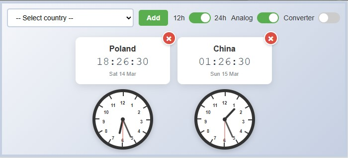
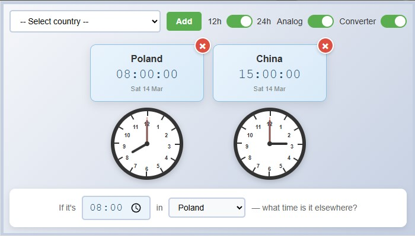

# World Clocks — Chrome Extension

A small Chrome extension that shows up to 3 world clocks.

Features

- Add up to 3 clocks from a country selector.
- Each clock shows a digital time, a short date, and an analog clock face.
- Selected clocks are remembered in browser storage (localStorage).
- Built-in time converter for quickly checking "what time is it elsewhere?".

How to install (developer / local)

1. Open Chrome and go to chrome://extensions
2. Enable "Developer mode" in the top-right.
3. Click "Load unpacked" and select this project folder (`world-clocks-extension`).
4. The extension's icon will appear in the toolbar. Click it to open the popup.

Usage

- Use the dropdown to choose a country and click "Add clock".
- You can add at most 3 clocks.
- To remove an added clock, click the red × in the top-right of the clock card.

Time Converter

The **Converter** toggle (top-right of the toolbar) reveals a converter bar at the bottom of the popup.

It lets you pick any time and a reference city, then instantly shows what that time corresponds to in all your added clocks — without changing the live display. Example: set `08:00` in `Poland` to see that it is `15:00` in China.

- The input accepts any time value (HH:MM).
- The city dropdown lists all currently added clocks as reference points.
- Clock cards update their displayed time to reflect the converted value while the converter is active.
- Toggling the converter off returns all clocks to live time.

Notes for developers

- Files of interest:
  - `popup.html` — popup markup and layout
  - `popup.js` — main logic: countries list, rendering, localStorage handling
  - `manifest.json` — extension manifest (MV3)
  - `icon.png` — extension icon
- The extension forces the digital display to English (`en-GB`) for consistent Latin numerals and English weekday/month names.
- The country select is shown alphabetically in the popup while the internal `COUNTRIES` array keeps stable indices so saved preferences don't break.

Time format (12/24h)

- The popup includes a toggle that switches between 12-hour (AM/PM) and 24-hour formats.
- The toggle is located next to the country selector and the "Add clock" button.
- The user's choice is saved in `localStorage` under the key `timeFormat` and uses the values `"12"` or `"24"`.
- By default the extension uses 24-hour format.
