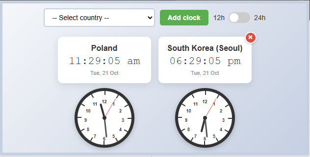

# World Clocks — Chrome Extension

A small Chrome extension that shows up to 3 world clocks.

Features

- Poland is shown by default and cannot be removed.
- Add up to 2 additional clocks (3 total) from a country selector.
- Each clock shows a digital time, a short date, and an analog clock face.
- Selected clocks are remembered in browser storage (localStorage).

How to install (developer / local)

1. Open Chrome and go to chrome://extensions
2. Enable "Developer mode" in the top-right.
3. Click "Load unpacked" and select this project folder (`zegary-chrome-extension`).
4. The extension's icon will appear in the toolbar. Click it to open the popup.

Usage

- Use the dropdown to choose a country and click "Add clock".
- You can add at most 3 clocks (Poland + 2 others).
- To remove an added clock, click the red × in the top-right of the clock card.

Notes for developers

- Files of interest:
  - `popup.html` — popup markup and layout
  - `popup.js` — main logic: countries list, rendering, localStorage handling
  - `manifest.json` — extension manifest (MV3)
  - `icon.png` — extension icon
- The extension forces the digital display to English (`en-GB`) for consistent Latin numerals and English weekday/month names.
- The country select is shown alphabetically in the popup while the internal `COUNTRIES` array keeps stable indices so saved preferences don't break.
